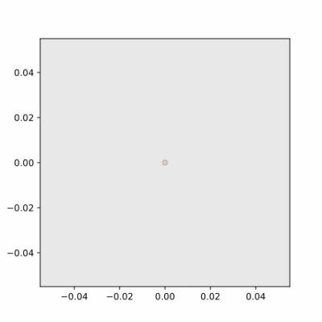
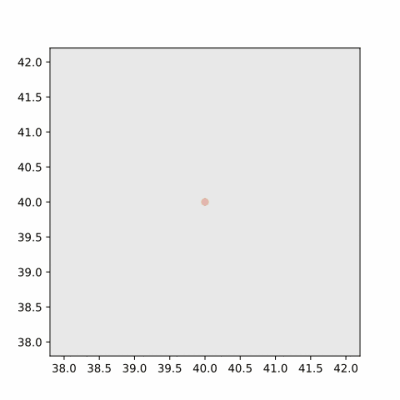
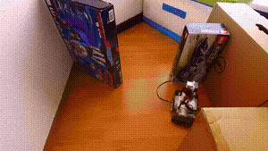

# SLAM with LEGO Mindstorms
A system that helps a robot to explore the world. By collecting measurements
from the robot's sensors and telling the robot where to go next, it constructs
a map of the world.

The robot can be either a real LEGO Mindstorms robot or a simulated one. It
is easier to develop the logic using the simulated robot, but it is much more
fun observing a physical robot wandering around.

## Examples
The GIFs below show two examples - one with the LEGO robot (left/top) and one
simulated (right/bottom).
For the explanation of symbols, see below.

Here is how the example with the LEGO robot looked like in practice (just much
much slower):

### Explanation of the maps:

- Red dots and the solid black line: Position of the robot through time
- Gray circle around the red dots: The size of the robot
- Orange dots and the black dashed line: Planned path
- Blue dots: Detected obstacles
- Light green dots: Detected free spots (the sensor has a limited view and
  can't see obstacles further than that)
- Dark green dots: Possible locations to continue exploration
- Blue cells in the grid: Expected obstacle positions
- Brown cells in the grid: Expected free positions

## How do I run it?
1. If the most recent version of Python that you have installed is below 3.8,
   you can't1. I'm sorry.
2. Clone this repository.
3. In the root directory, run:
   1. `make init` to create a virtual environment and install requirements,
   2. `make run` to run the program.
4. In the subsequent runs, only `make run` is needed.

That's it for the simulated robot! Nothing difficult, you should try it
out2!

To change the world the robot is in, try changing `WORLD_NUMBER` and 
`ROBOT_SIZE` in `slam/config.py`. You can as well define your own world in 
`slam/world/simulated.py`.

### But I have a LEGO EV3 Brick and I want to see it in action!
1. Check that you have Python 3.8 (or higher) installed on your computer.
2. Build a robot - [see what I have done](https://github.com/RdecKa/SLAM-with-LEGO-Mindstorms/wiki/The-Robot).
3. Clone this repository.
4. Set HOST and PORT in `slam/config.py` and `slam/mindstorms/slam_lego/config.py`.
   HOST should be the IP address of the EV3. Make sure the ports in both files
   are the same.
5. Connect your EV3 Brick to WiFi. You will need a USB WiFi Dongle.
6. Upload the content of `slam/mindstorms/slam_lego` to your EV3 (I'm
   using [ev3dev](https://www.ev3dev.org)).
7. Run `python3 main.py` on the EV3.
8. On your computer, run the following from the root directory:
   1. `make init`
   2. `make runlego`
9. In the subsequent runs, only `make runlego` is needed.

## What can be done next?
- Use a better path planning algorithm
- Improve scalability to be able to run on bigger worlds
- Decouple `ObservedWorld`, `Planner` and `PathPlanner`
- Add touch and gyro sensors to the robot to help with orientation

1There is not so much Python 3.8 syntax. It should not be that
difficult to rewrite the program in Python 3.7 - if you really want, feel free
to do so.

2Developed on (Arch) Linux. Not tested on different platforms.
